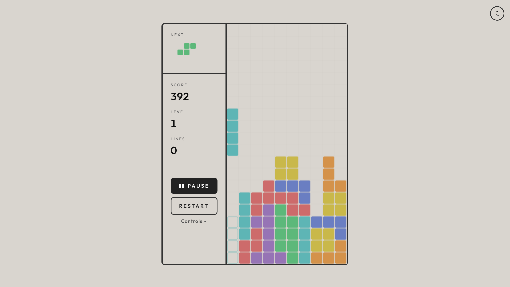

# Tetris

A clean, minimalist Tetris game built as a single HTML file. No dependencies, no build step.

**[Play it live](https://davidsenack.github.io/tetris/)**



## Play

Open `index.html` in a browser, or serve it:

```
python3 -m http.server 8080
```

Then visit `http://localhost:8080`.

## Controls

| Key | Action |
|-----|--------|
| ← → | Move |
| ↑ | Rotate |
| ↓ | Soft drop |
| Space | Hard drop |
| P / Esc | Pause |

## Features

- Light/dark theme toggle
- Minimalist UI with clean typography (Outfit)
- 7-bag randomizer for fair piece distribution
- Ghost piece preview
- Next piece display
- Line clear animation with sound
- Auto-pause on tab/window switch
- DAS (Delayed Auto Shift) for fast movement
- Synthesized sound effects via Web Audio API
- Score, level, and lines tracking
